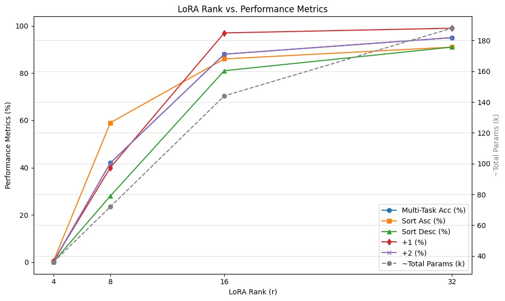

# Implementing Transformers

This repository was created for the _Implementing Transformers_ seminar at HHU, led by Dr. Carel van Niekerk. It includes:

- An implementation of the Base Transformer from ["Attention Is All You Need"](https://arxiv.org/abs/1706.03762).
- A small-scale experiment on fine-tuning with LoRA for a synthetic task.

## Installation and Environment Setup

1. Install Poetry from the [official site](https://python-poetry.org/docs/).
2. In the repository root, install dependencies:

   ```sh
   poetry install
   ```

3. Activate the environment (shell):

   ```sh
   poetry shell
   ```

The global paths are defined in `config/paths.py` this omits relative imports in the files and keeps the code clean.

## Testing

The tests will fail if you dont comment out the dropout in `attention.py`
so for passing tests please set

```python
#attn_weights = self.dropout(attn_weights)
```

## Usage

- Configure paths in `config\paths.py`.
- Configure model parameters and training details in `src/config`
- Start training with:

  ```sh
  python src/run/main.py
  ```

## LoRA Experiments

LoRA-related code and scripts reside in `\experiment`. The training procedure for LoRA is handled via the `trainer` in `main.py`.

Here are the results of the Rank experiment:



## notebooks

I used notebooks for a small EDA and for evaluation of the Base Transformer results `evaluate_analysis.ipnyb`
# transformer
